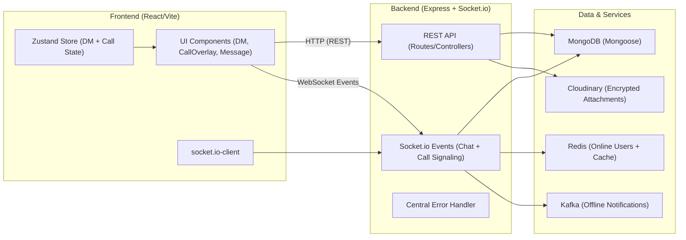

# Frontend Documentation (React + Vite + Socket.io + WebRTC)

This frontend is the UI for the chat + calling app.

## Main ideas (easy language)

1. **REST for fetching**: when you open a DM, the app fetches messages using HTTP.
2. **Socket.io for live updates**: when another user sends a message, the server emits a socket event and the UI updates instantly.
3. **WebRTC for audio/video calls**: Socket.io is used only for signaling (offer/answer/ICE candidates).
4. **Zustand for shared state**: DM info, message list, and call state live in a single store.

## How everything connects (big picture)

## Key files (what each one does)

### Socket client
- `frontend/src/socket.js`
  - Creates the shared Socket.io client (`autoConnect: false`)
  - Uses `VITE_BACKEND_URL` to connect to the backend

### State management
- `frontend/src/store/useDmStore.js`
  - Holds:
    - `currentUser`
    - `dms` + `onlineUsers`
    - `activeDm` and `messages`
    - call state: `callState`, `callType`, `callPeer`, streams, mute/cam toggles

### Main page (calls + signaling listeners)
- `frontend/src/pages/Home.jsx`
  - Renders:
    - `SidebarShowcase`
    - `SectionContainer` (DM/settings/main content)
    - `CallOverlay` (global WebRTC UI)
  - Registers Socket.io listeners for:
    - `call-incoming`, `call-answered`, `ice-candidate`, `call-rejected`, `call-ended`
  - Buffers ICE candidates until `RTCPeerConnection` remote description is ready

### DM / chat components
- `frontend/src/components/normal/OpenDm.jsx`
  - When `activeDm.channelId` changes:
    - fetches messages using `GET /message/:channelId`
    - joins the socket room: `socket.emit("join_channel", { channelId })`
    - on new messages updates the store (via `receive_message` event)
  - On leaving DM it emits `leave_channel`

- `frontend/src/components/normal/InputBar.jsx`
  - Sends messages from the active DM
  - For text:
    - encrypts with `encryptText(...)`
    - emits `socket.emit("send_message", { channelId, content, attachment })`
  - For attachments:
    - uploads encrypted data to Cloudinary
    - emits `send_message` with the returned `secure_url` as `attachment`

- `frontend/src/components/normal/Message.jsx`
  - Decrypts message text using `decryptText(message.content, activeDm.channelId)`
  - For attachments:
    - fetches encrypted attachment
    - decrypts it in `DecryptedAttachment`

### Call UI
- `frontend/src/components/normal/CallOverlay.jsx`
  - Handles call accept/decline + WebRTC setup
  - Uses the store to read/update streams and toggles
  - Sends signaling events to backend:
    - `call-user` and `make-answer`
    - `ice-candidate`

## Crypto helper
- `frontend/src/utils/cryptoHelper.js`
  - Encrypts/decrypts text and attachment payloads with **AES (CryptoJS)**
  - Uses the `channelId` as the encryption key

## Running
- Backend dev: `cd backend && npm run dev`
- Frontend dev: `cd frontend && npm run dev`
- Run tests: `npm test` (Node’s built-in test runner)
